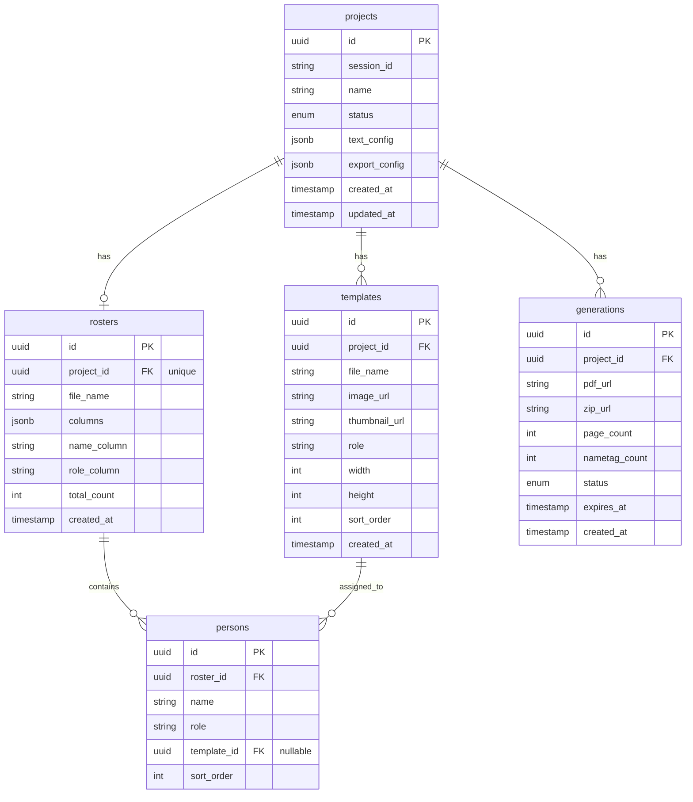

# Database Schema

## ER Diagram



---

## Tables

### projects

프로젝트 테이블. 하나의 명찰 제작 세션을 나타냅니다.

| Column | Type | Nullable | Default | Description |
|--------|------|----------|---------|-------------|
| `id` | UUID | NO | auto-gen | Primary Key |
| `session_id` | VARCHAR(255) | YES | - | 쿠키 기반 세션 ID |
| `name` | VARCHAR(255) | NO | - | 프로젝트 이름 |
| `status` | ENUM | NO | `DRAFT` | `DRAFT`, `COMPLETED` |
| `text_config` | JSONB | YES | - | 텍스트 설정 (JSON) |
| `export_config` | JSONB | YES | - | 내보내기 설정 (JSON) |
| `created_at` | TIMESTAMP | YES | now() | 생성일시 |
| `updated_at` | TIMESTAMP | YES | now() | 수정일시 |

**Indexes:**
- `PRIMARY KEY (id)`
- `INDEX idx_projects_session_id (session_id)`

**text_config JSON Structure:**
```json
{
  "position": {
    "x": 50,
    "y": 50,
    "anchor": "center"
  },
  "style": {
    "fontFamily": "Pretendard",
    "fontSize": 36,
    "fontWeight": 700,
    "color": "#000000"
  }
}
```

**export_config JSON Structure:**
```json
{
  "paperSize": "A4",
  "layout": "2x2",
  "margin": 10,
  "dpi": 300,
  "sizeMode": "auto",
  "fixedWidth": 90,
  "fixedHeight": 55,
  "blankPages": 0,
  "blankPagesPerTemplate": {}
}
```

---

### templates

템플릿(명찰 배경 이미지) 테이블.

| Column | Type | Nullable | Default | Description |
|--------|------|----------|---------|-------------|
| `id` | UUID | NO | auto-gen | Primary Key |
| `project_id` | UUID | NO | - | FK → projects |
| `file_name` | VARCHAR(255) | NO | - | 원본 파일명 |
| `image_url` | VARCHAR(500) | NO | - | S3 이미지 URL |
| `thumbnail_url` | VARCHAR(500) | YES | - | 썸네일 URL |
| `role` | VARCHAR(100) | YES | - | 역할명 (멀티 템플릿용) |
| `width` | INTEGER | NO | - | 이미지 너비 (px) |
| `height` | INTEGER | NO | - | 이미지 높이 (px) |
| `sort_order` | INTEGER | NO | 0 | 정렬 순서 |
| `created_at` | TIMESTAMP | YES | now() | 생성일시 |

**Indexes:**
- `PRIMARY KEY (id)`
- `INDEX idx_templates_project_id (project_id)`

**Constraints:**
- `FOREIGN KEY (project_id) REFERENCES projects(id) ON DELETE CASCADE`

---

### rosters

명단 테이블. 프로젝트당 하나의 명단만 가능합니다.

| Column | Type | Nullable | Default | Description |
|--------|------|----------|---------|-------------|
| `id` | UUID | NO | auto-gen | Primary Key |
| `project_id` | UUID | NO | - | FK → projects (UNIQUE) |
| `file_name` | VARCHAR(255) | NO | - | 원본 파일명 |
| `columns` | JSONB | YES | - | 컬럼 목록 (JSON 배열) |
| `name_column` | VARCHAR(100) | NO | - | 이름 컬럼명 |
| `role_column` | VARCHAR(100) | YES | - | 역할 컬럼명 |
| `total_count` | INTEGER | NO | - | 총 인원 수 |
| `created_at` | TIMESTAMP | YES | now() | 생성일시 |

**Indexes:**
- `PRIMARY KEY (id)`
- `UNIQUE INDEX idx_rosters_project_id (project_id)`

**Constraints:**
- `FOREIGN KEY (project_id) REFERENCES projects(id) ON DELETE CASCADE`

**columns JSON Example:**
```json
["이름", "소속", "역할", "연락처"]
```

---

### persons

개인 정보 테이블. 명단에 포함된 각 개인을 나타냅니다.

| Column | Type | Nullable | Default | Description |
|--------|------|----------|---------|-------------|
| `id` | UUID | NO | auto-gen | Primary Key |
| `roster_id` | UUID | NO | - | FK → rosters |
| `name` | VARCHAR(255) | NO | - | 이름 |
| `role` | VARCHAR(100) | YES | - | 역할 |
| `template_id` | UUID | YES | - | FK → templates (매핑된 템플릿) |
| `sort_order` | INTEGER | NO | 0 | 정렬 순서 |

**Indexes:**
- `PRIMARY KEY (id)`
- `INDEX idx_persons_roster_id (roster_id)`
- `INDEX idx_persons_template_id (template_id)`

**Constraints:**
- `FOREIGN KEY (roster_id) REFERENCES rosters(id) ON DELETE CASCADE`
- `FOREIGN KEY (template_id) REFERENCES templates(id) ON DELETE SET NULL`

---

### generations

PDF 생성 이력 테이블.

| Column | Type | Nullable | Default | Description |
|--------|------|----------|---------|-------------|
| `id` | UUID | NO | auto-gen | Primary Key |
| `project_id` | UUID | NO | - | FK → projects |
| `pdf_url` | VARCHAR(500) | YES | - | 생성된 PDF URL |
| `zip_url` | VARCHAR(500) | YES | - | 생성된 ZIP URL |
| `page_count` | INTEGER | YES | - | PDF 페이지 수 |
| `nametag_count` | INTEGER | YES | - | 명찰 개수 |
| `status` | ENUM | NO | `PROCESSING` | `PROCESSING`, `COMPLETED`, `FAILED` |
| `expires_at` | TIMESTAMP | YES | - | 파일 만료일시 |
| `created_at` | TIMESTAMP | YES | now() | 생성일시 |

**Indexes:**
- `PRIMARY KEY (id)`
- `INDEX idx_generations_project_id (project_id)`
- `INDEX idx_generations_status (status)`

**Constraints:**
- `FOREIGN KEY (project_id) REFERENCES projects(id) ON DELETE CASCADE`

---

## Relationships

| From | To | Type | Description |
|------|----|------|-------------|
| projects | templates | 1:N | 프로젝트는 여러 템플릿을 가질 수 있음 |
| projects | rosters | 1:1 | 프로젝트는 하나의 명단만 가질 수 있음 |
| projects | generations | 1:N | 프로젝트는 여러 생성 이력을 가질 수 있음 |
| rosters | persons | 1:N | 명단은 여러 개인을 포함함 |
| templates | persons | 1:N | 템플릿은 여러 개인에게 할당될 수 있음 |

---

## Database Configuration

**Database:** PostgreSQL

**Connection:**
```yaml
spring:
  datasource:
    url: jdbc:postgresql://${DB_HOST}:5432/${DB_NAME}
    username: ${DB_USER}
    password: ${DB_PASSWORD}
  jpa:
    database-platform: org.hibernate.dialect.PostgreSQLDialect
    hibernate:
      ddl-auto: update
```

**JSONB Support:**
- Hibernate Types 라이브러리 사용
- `@Column(columnDefinition = "jsonb")` 어노테이션

---

## Data Lifecycle

1. **Project Creation:**
   - 세션 ID 기반으로 프로젝트 생성
   - 7일간 쿠키 유지

2. **Template Upload:**
   - S3에 이미지 업로드
   - URL 저장

3. **Roster Upload:**
   - Excel/CSV 파싱
   - persons 테이블에 개별 행 저장

4. **PDF Generation:**
   - generations 테이블에 기록
   - S3에 PDF 업로드
   - 만료일 설정 (예: 7일)

5. **Cleanup:**
   - 만료된 generations의 S3 파일 삭제
   - 오래된 프로젝트 정리 (배치 작업)
