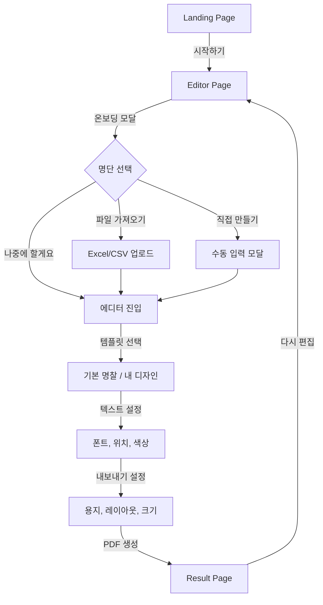
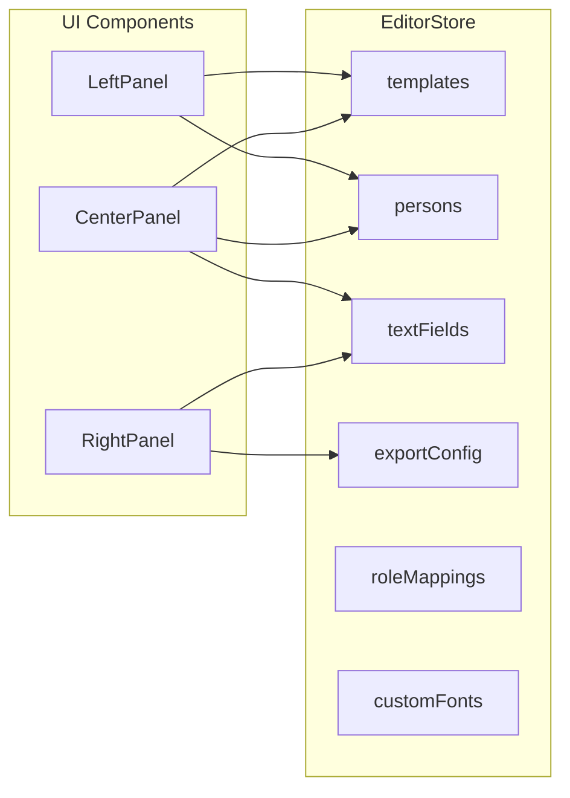

# Information Architecture

## Project Overview

**NameTag Pro**는 명찰(이름표)을 대량으로 생성하고 PDF로 출력할 수 있는 웹 애플리케이션입니다.

## Project Structure

```
nametag-pro/
├── frontend/                          # Next.js 14 프론트엔드
│   ├── messages/                      # 다국어 번역 파일
│   │   ├── ko.json                    # 한국어
│   │   └── en.json                    # 영어
│   ├── src/
│   │   ├── app/
│   │   │   ├── layout.tsx             # 루트 레이아웃
│   │   │   ├── sitemap.ts             # 동적 사이트맵
│   │   │   ├── robots.ts              # robots.txt
│   │   │   └── [locale]/              # 다국어 라우팅 (i18n)
│   │   │       ├── layout.tsx         # 로케일 레이아웃
│   │   │       ├── page.tsx           # 랜딩 페이지
│   │   │       ├── providers.tsx      # 전역 Provider
│   │   │       ├── editor/page.tsx    # 에디터 페이지
│   │   │       ├── result/page.tsx    # 결과 페이지
│   │   │       └── privacy/page.tsx   # 개인정보처리방침
│   │   ├── i18n/                      # 국제화 설정
│   │   │   ├── routing.ts             # 로케일 라우팅 설정
│   │   │   └── request.ts             # 번역 메시지 로드
│   │   ├── middleware.ts              # i18n 미들웨어
│   │   ├── components/
│   │   │   ├── editor/                # 에디터 컴포넌트
│   │   │   │   ├── left-panel/        # 좌측 패널 (템플릿/명단)
│   │   │   │   ├── center-panel/      # 중앙 패널 (미리보기)
│   │   │   │   └── right-panel/       # 우측 패널 (설정)
│   │   │   ├── landing/               # 랜딩 페이지 컴포넌트
│   │   │   ├── seo/                   # SEO 컴포넌트 (JSON-LD)
│   │   │   ├── language-switcher.tsx  # 언어 전환 버튼
│   │   │   └── ui/                    # 공통 UI 컴포넌트
│   │   ├── stores/                    # Zustand 상태 관리
│   │   ├── hooks/                     # 커스텀 훅
│   │   ├── lib/                       # 유틸리티 함수
│   │   └── types/                     # TypeScript 타입 정의
│   └── public/                        # 정적 파일
│
├── backend/                           # Spring Boot 백엔드
│   └── src/main/java/com/nametagpro/
│       ├── config/                    # 설정 클래스
│       ├── controller/                # REST 컨트롤러
│       ├── dto/                       # 데이터 전송 객체
│       │   ├── request/               # 요청 DTO
│       │   └── response/              # 응답 DTO
│       ├── entity/                    # JPA 엔티티
│       ├── exception/                 # 예외 처리
│       ├── repository/                # JPA 레포지토리
│       └── service/                   # 비즈니스 로직
│
└── infrastructure/                    # 인프라 설정
    └── terraform/                     # Terraform IaC
```

## Module Architecture

| 모듈 | 경로 | 설명 |
|------|------|------|
| Landing | frontend/src/components/landing/ | 랜딩 페이지 UI |
| Editor | frontend/src/components/editor/ | 명찰 에디터 메인 기능 |
| Left Panel | frontend/src/components/editor/left-panel/ | 템플릿/명단 관리 |
| Center Panel | frontend/src/components/editor/center-panel/ | 실시간 미리보기 |
| Right Panel | frontend/src/components/editor/right-panel/ | 텍스트/출력 설정 |
| Store | frontend/src/stores/ | 전역 상태 관리 |
| i18n | frontend/src/i18n/ | 국제화 설정 |
| SEO | frontend/src/components/seo/ | SEO 구조화 데이터 |
| API | backend/src/.../controller/ | REST API 엔드포인트 |
| Service | backend/src/.../service/ | 비즈니스 로직 |
| Repository | backend/src/.../repository/ | 데이터 접근 계층 |

## Page Structure

| 페이지 | 라우트 | 설명 |
|--------|--------|------|
| Landing | `/[locale]` | 서비스 소개 및 시작하기 |
| Editor | `/[locale]/editor` | 명찰 에디터 (메인 기능) |
| Result | `/[locale]/result` | PDF 생성 결과 및 다운로드 |
| Privacy | `/[locale]/privacy` | 개인정보처리방침 |

### URL Examples

| 한국어 | 영어 |
|--------|------|
| `/ko` | `/en` |
| `/ko/editor` | `/en/editor` |
| `/ko/result` | `/en/result` |

## Navigation Flow



## Feature Modules

### 1. Template Management
- 기본 명찰 템플릿 (SVG 기반)
- 커스텀 이미지 업로드 (JPG, PNG)
- 멀티 템플릿 지원 (역할별 다른 디자인)
- 역할별 색상 지정 (기본 명찰 모드)

### 2. Roster Management
- Excel/CSV 파일 업로드
- 수동 명단 입력
- 컬럼 자동 감지 (이름, 역할)
- 역할별 템플릿 매핑

### 3. Text Configuration
- 다중 텍스트 필드 지원
- 드래그 앤 드롭 위치 조정
- 폰트 패밀리, 크기, 굵기, 색상 설정
- 커스텀 폰트 업로드

### 4. Export Configuration
- 용지 크기 (A4, Letter)
- 레이아웃 (2x2, 2x3, 3x3, 2x4)
- 고정 크기 모드 (mm 단위)
- 빈 페이지 추가 (수기 작성용)

### 5. PDF Generation
- 클라이언트 사이드 PDF 생성 (jsPDF)
- Canvas 기반 명찰 렌더링 (Konva)
- 다운로드 기능

## State Management



## Data Flow

1. **Template Upload**: User → Left Panel → EditorStore → Preview
2. **Roster Upload**: User → Left Panel → EditorStore → Preview
3. **Text Config**: User → Right Panel → EditorStore → Preview
4. **PDF Generation**: EditorStore → PDF Generator → Download
