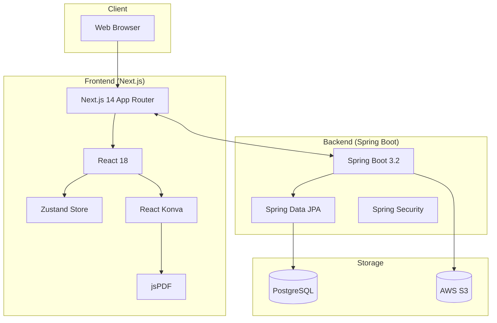

# Tech Stack

## Architecture Overview



---

## Frontend Stack

### Core Framework

| Package | Version | Purpose |
|---------|---------|---------|
| **Next.js** | 14.2.20 | React 프레임워크 (App Router) |
| **React** | 18.3.1 | UI 라이브러리 |
| **TypeScript** | 5.7.2 | 타입 안전성 |

### State Management

| Package | Version | Purpose |
|---------|---------|---------|
| **Zustand** | 5.0.2 | 전역 상태 관리 |
| **@tanstack/react-query** | 5.62.0 | 서버 상태 관리 |

### UI & Styling

| Package | Version | Purpose |
|---------|---------|---------|
| **Tailwind CSS** | 3.4.17 | 유틸리티 CSS |
| **Framer Motion** | 11.15.0 | 애니메이션 |
| **Lucide React** | 0.468.0 | 아이콘 |
| **clsx** | 2.1.1 | 조건부 클래스 |
| **tailwind-merge** | 2.6.0 | Tailwind 클래스 병합 |
| **class-variance-authority** | 0.7.1 | 컴포넌트 variants |

### Canvas & PDF

| Package | Version | Purpose |
|---------|---------|---------|
| **Konva** | 9.3.18 | 2D Canvas 라이브러리 |
| **react-konva** | 18.2.10 | React Konva 바인딩 |
| **jsPDF** | 2.5.2 | PDF 생성 |

### Form & Validation

| Package | Version | Purpose |
|---------|---------|---------|
| **react-hook-form** | 7.54.2 | 폼 관리 |
| **@hookform/resolvers** | 3.9.1 | 폼 검증 리졸버 |
| **Zod** | 3.24.1 | 스키마 검증 |

### File Handling

| Package | Version | Purpose |
|---------|---------|---------|
| **react-dropzone** | 14.3.5 | 드래그 앤 드롭 파일 업로드 |
| **xlsx** | 0.18.5 | Excel/CSV 파싱 |

### Dev Tools

| Package | Version | Purpose |
|---------|---------|---------|
| **ESLint** | 8.57.1 | 코드 린팅 |
| **eslint-config-next** | 14.2.20 | Next.js ESLint 설정 |
| **PostCSS** | 8.4.49 | CSS 후처리 |
| **Autoprefixer** | 10.4.20 | CSS 벤더 프리픽스 |

---

## Backend Stack

### Core Framework

| Package | Version | Purpose |
|---------|---------|---------|
| **Spring Boot** | 3.2.5 | Java 웹 프레임워크 |
| **Java** | 17 | 프로그래밍 언어 |
| **Gradle** | - | 빌드 도구 |

### Web & API

| Package | Version | Purpose |
|---------|---------|---------|
| **spring-boot-starter-web** | - | REST API |
| **spring-boot-starter-validation** | - | 입력 검증 |
| **spring-boot-starter-security** | - | 보안 |

### Database

| Package | Version | Purpose |
|---------|---------|---------|
| **spring-boot-starter-data-jpa** | - | JPA/Hibernate |
| **PostgreSQL Driver** | - | PostgreSQL 연결 |
| **hibernate-types-60** | 2.21.1 | JSONB 지원 |

### Cloud & Storage

| Package | Version | Purpose |
|---------|---------|---------|
| **AWS SDK S3** | 2.25.0 | S3 파일 저장 |

### Document Processing

| Package | Version | Purpose |
|---------|---------|---------|
| **Apache PDFBox** | 3.0.1 | PDF 처리 |
| **Apache POI** | 5.2.5 | Excel 처리 |

### Security

| Package | Version | Purpose |
|---------|---------|---------|
| **jjwt-api** | 0.12.5 | JWT 토큰 |
| **jjwt-impl** | 0.12.5 | JWT 구현 |
| **jjwt-jackson** | 0.12.5 | JWT Jackson |

### Utilities

| Package | Version | Purpose |
|---------|---------|---------|
| **Lombok** | - | 보일러플레이트 감소 |
| **spring-boot-devtools** | - | 개발 도구 |

### Testing

| Package | Version | Purpose |
|---------|---------|---------|
| **spring-boot-starter-test** | - | 테스트 프레임워크 |
| **spring-security-test** | - | 보안 테스트 |
| **H2** | - | 인메모리 DB (테스트용) |

---

## Infrastructure

### Cloud Services (AWS)

| Service | Purpose |
|---------|---------|
| **EC2** | 백엔드 서버 호스팅 |
| **S3** | 이미지/PDF 파일 저장 |
| **RDS** | PostgreSQL 데이터베이스 |
| **CloudFront** | CDN (프론트엔드) |
| **ECR** | Docker 이미지 저장소 |

### CI/CD

| Tool | Purpose |
|------|---------|
| **GitHub Actions** | CI/CD 파이프라인 |
| **Terraform** | Infrastructure as Code |
| **Docker** | 컨테이너화 |

### Monitoring

| Tool | Purpose |
|------|---------|
| **CloudWatch** | 로그 및 메트릭 |

---

## Development Environment

### Prerequisites

| Tool | Version | Required |
|------|---------|----------|
| Node.js | 18+ | Yes |
| npm | 9+ | Yes |
| Java | 17+ | Yes |
| Docker | 24+ | Optional |
| PostgreSQL | 15+ | Yes (local) |

### Environment Variables

**Frontend (.env.local)**
```env
NEXT_PUBLIC_API_URL=http://localhost:8080
```

**Backend (application.yml)**
```yaml
spring:
  datasource:
    url: jdbc:postgresql://${DB_HOST:localhost}:5432/${DB_NAME:nametagpro}
    username: ${DB_USER:postgres}
    password: ${DB_PASSWORD:password}

aws:
  s3:
    bucket: ${S3_BUCKET}
    region: ${AWS_REGION:ap-northeast-2}
```

---

## Architecture Patterns

### Frontend

| Pattern | Description |
|---------|-------------|
| **App Router** | Next.js 14 파일 기반 라우팅 |
| **Server Components** | RSC 활용 (일부) |
| **Client Components** | 인터랙티브 UI |
| **Atomic Design** | 컴포넌트 구조화 |
| **Feature-based** | 기능별 폴더 구조 |

### Backend

| Pattern | Description |
|---------|-------------|
| **Layered Architecture** | Controller → Service → Repository |
| **DTO Pattern** | 요청/응답 객체 분리 |
| **Repository Pattern** | 데이터 접근 추상화 |
| **Builder Pattern** | 엔티티/DTO 생성 |

### State Management

```
┌─────────────────────────────────────────────────────┐
│                   EditorStore                        │
│  (Zustand + devtools + persist middleware)          │
├─────────────────────────────────────────────────────┤
│  - templates[]      - persons[]                      │
│  - textFields[]     - exportConfig                   │
│  - roleMappings     - customFonts[]                  │
└─────────────────────────────────────────────────────┘
           │
           ▼
┌─────────────────────────────────────────────────────┐
│              React Components                        │
│  (useEditorStore hooks)                             │
└─────────────────────────────────────────────────────┘
```

---

## Build & Deploy

### Frontend Build

```bash
cd frontend
npm install
npm run build
npm start
```

### Backend Build

```bash
cd backend
./gradlew build
java -jar build/libs/nametagpro-0.0.1-SNAPSHOT.jar
```

### Docker

```dockerfile
# Frontend
FROM node:18-alpine
WORKDIR /app
COPY . .
RUN npm ci && npm run build
CMD ["npm", "start"]

# Backend
FROM eclipse-temurin:17-jre
COPY build/libs/*.jar app.jar
ENTRYPOINT ["java", "-jar", "/app.jar"]
```

---

## Performance Considerations

### Frontend

- **Code Splitting**: Next.js 자동 코드 분할
- **Image Optimization**: Next.js Image 컴포넌트
- **Font Optimization**: next/font 사용
- **Canvas Optimization**: Konva 레이어 분리

### Backend

- **Connection Pooling**: HikariCP (기본값)
- **Lazy Loading**: JPA 연관관계 지연 로딩
- **Query Optimization**: 필요한 필드만 조회

### Storage

- **S3 Pre-signed URLs**: 직접 업로드/다운로드
- **File Compression**: 이미지 압축 (클라이언트)

---

## Security

### Frontend

- **XSS Prevention**: React 자동 이스케이프
- **HTTPS**: 프로덕션 필수

### Backend

- **CORS**: 화이트리스트 도메인만 허용
- **Session Cookie**: HttpOnly, Secure
- **Input Validation**: @Valid 어노테이션
- **SQL Injection**: JPA 파라미터 바인딩

### Infrastructure

- **VPC**: 프라이빗 서브넷 (DB)
- **Security Groups**: 최소 권한 원칙
- **IAM Roles**: EC2 인스턴스 역할
