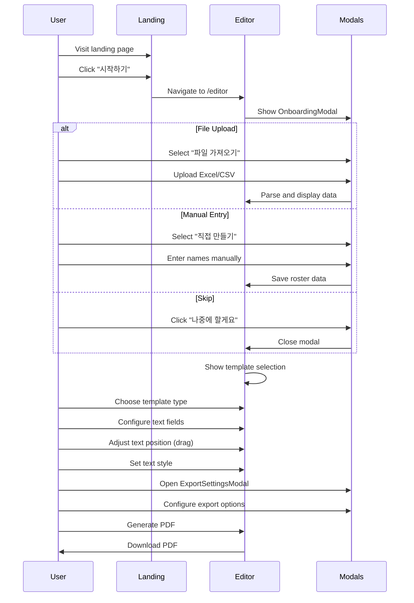

# Wireframe - UI Structure

## Page Components

### 1. Landing Page (`/`)

```
┌─────────────────────────────────────────────────────────────────┐
│                         Header                                   │
│  Logo                                        [시작하기] Button   │
├─────────────────────────────────────────────────────────────────┤
│                                                                  │
│                      Hero Section                                │
│   ┌─────────────────────────────────────────────────────────┐   │
│   │  "명찰 제작이 이렇게 쉬웠나요?"                          │   │
│   │  "Excel 명단만 있으면 1분 안에 완성"                     │   │
│   │                                                          │   │
│   │  [무료로 시작하기] Button                                │   │
│   └─────────────────────────────────────────────────────────┘   │
│                                                                  │
│                    Features Section                              │
│   ┌──────────┐  ┌──────────┐  ┌──────────┐  ┌──────────┐       │
│   │ Feature1 │  │ Feature2 │  │ Feature3 │  │ Feature4 │       │
│   │ 파일업로드│  │실시간미리보기│  │다양한템플릿│  │PDF내보내기 │       │
│   └──────────┘  └──────────┘  └──────────┘  └──────────┘       │
│                                                                  │
├─────────────────────────────────────────────────────────────────┤
│                         Footer                                   │
│  © 2025 NameTag Pro. All rights reserved.                       │
└─────────────────────────────────────────────────────────────────┘
```

**Components:**
- `HeroSection`: 메인 헤드라인 및 CTA
- `FeaturesSection`: 주요 기능 소개 카드
- `Footer`: 저작권 정보

---

### 2. Editor Page (`/editor`)

```
┌─────────────────────────────────────────────────────────────────────────┐
│ Header Bar                                                               │
│ [←] NameTag Pro                              [내보내기 설정] [PDF 생성]  │
├────────────┬───────────────────────────────────────┬────────────────────┤
│            │                                       │                    │
│ Left Panel │         Center Panel                  │    Right Panel     │
│   280px    │           (flex)                      │      320px         │
│            │                                       │                    │
│ ┌────────┐ │  ┌─────────────────────────────────┐  │  ┌──────────────┐  │
│ │템플릿  │ │  │                                 │  │  │ 텍스트 설정   │  │
│ │선택    │ │  │                                 │  │  │              │  │
│ │        │ │  │      명찰 미리보기               │  │  │ 폰트 선택    │  │
│ │[기본]  │ │  │      (Canvas)                   │  │  │ [Pretendard]│  │
│ │[커스텀]│ │  │                                 │  │  │              │  │
│ └────────┘ │  │  ┌─────────────────────────┐    │  │  │ 글자 크기    │  │
│            │  │  │      NAME TAG           │    │  │  │ [36]        │  │
│ ┌────────┐ │  │  │                         │    │  │  │              │  │
│ │명단    │ │  │  │      홍길동              │    │  │  │ 글자 색상    │  │
│ │        │ │  │  │      개발팀              │    │  │  │ [#000000]   │  │
│ │[업로드]│ │  │  │                         │    │  │  │              │  │
│ │[직접]  │ │  │  └─────────────────────────┘    │  │  └──────────────┘  │
│ │        │ │  │                                 │  │                    │
│ │ 총 10명│ │  │  ◀ 1/10 ▶                       │  │  ┌──────────────┐  │
│ │ 개발팀 5│ │  │                                 │  │  │ 텍스트 필드   │  │
│ │ 디자인 3│ │  └─────────────────────────────────┘  │  │              │  │
│ │ 기획 2 │ │                                       │  │ [이름] ✕     │  │
│ └────────┘ │                                       │  │ [소속] ✕     │  │
│            │                                       │  │              │  │
│            │                                       │  │ [+ 필드추가] │  │
│            │                                       │  └──────────────┘  │
└────────────┴───────────────────────────────────────┴────────────────────┘
```

**Components:**

#### Left Panel (`left-panel/index.tsx`)
| Component | File | Description |
|-----------|------|-------------|
| TemplateUpload | `template-upload.tsx` | 템플릿 이미지 업로드 |
| TemplateList | `template-list.tsx` | 업로드된 템플릿 목록 |
| DataUpload | `data-upload.tsx` | Excel/CSV 업로드 |
| DataPreview | `data-preview.tsx` | 명단 미리보기 테이블 |
| RoleMapping | `role-mapping.tsx` | 역할-템플릿 매핑 |
| ColumnConfig | `column-config.tsx` | 컬럼 설정 |

#### Center Panel (`center-panel/index.tsx`)
| Component | Description |
|-----------|-------------|
| Canvas Preview | Konva 기반 명찰 미리보기 |
| Navigation | 이전/다음 명단 네비게이션 |
| Zoom Controls | 확대/축소 컨트롤 |

#### Right Panel (`right-panel/index.tsx`)
| Component | Description |
|-----------|-------------|
| Text Settings | 폰트, 크기, 색상 설정 |
| Text Fields | 텍스트 필드 목록 관리 |
| Position Info | 선택된 필드 위치 정보 |

---

### 3. Modals

#### Onboarding Modal
```
┌─────────────────────────────────────┐
│                              [✕]    │
│         ┌─────┐                     │
│         │ 📄  │                     │
│         └─────┘                     │
│                                     │
│      명단을 준비해주세요              │
│  명찰에 표시할 이름과 정보를          │
│  불러오거나 직접 입력하세요           │
│                                     │
│  ┌───────────┐  ┌───────────┐      │
│  │ 📄        │  │ ✏️         │      │
│  │파일 가져오기│  │직접 만들기  │      │
│  │Excel, CSV │  │수동 입력   │      │
│  └───────────┘  └───────────┘      │
│                                     │
│         나중에 할게요 →              │
└─────────────────────────────────────┘
```

#### Export Settings Modal
```
┌─────────────────────────────────────┐
│ 내보내기 설정                  [✕]   │
├─────────────────────────────────────┤
│                                     │
│  용지 크기                           │
│  ○ A4  ● Letter                     │
│                                     │
│  레이아웃                            │
│  [2x2] [2x3] [3x3] [2x4]            │
│                                     │
│  명찰 크기                           │
│  ○ 자동 (레이아웃 기준)              │
│  ● 고정 크기                         │
│     가로 [90] mm  세로 [55] mm       │
│                                     │
│  빈 페이지 추가                       │
│  [0] 장                             │
│                                     │
├─────────────────────────────────────┤
│                    [취소] [PDF 생성] │
└─────────────────────────────────────┘
```

#### Template Selection Modal
```
┌─────────────────────────────────────┐
│ 템플릿 유형 선택               [✕]   │
├─────────────────────────────────────┤
│                                     │
│  ┌───────────┐  ┌───────────┐      │
│  │ ✨        │  │ 🖼️         │      │
│  │ 기본 명찰  │  │ 내 디자인   │      │
│  │           │  │            │      │
│  │ 심플한    │  │ 이미지를    │      │
│  │ 기본 디자인│  │ 업로드하세요│      │
│  └───────────┘  └───────────┘      │
│                                     │
└─────────────────────────────────────┘
```

#### Manual Entry Modal
```
┌─────────────────────────────────────┐
│ 명단 직접 만들기               [✕]   │
├─────────────────────────────────────┤
│                                     │
│  컬럼 설정                           │
│  [이름] [✕]  [소속] [✕]  [+ 추가]   │
│                                     │
│  ┌────────────────────────────┐     │
│  │ 이름         │ 소속        │     │
│  ├────────────────────────────┤     │
│  │ 홍길동       │ 개발팀      │     │
│  │ 김철수       │ 디자인팀    │     │
│  │ [새 행 추가]               │     │
│  └────────────────────────────┘     │
│                                     │
├─────────────────────────────────────┤
│                     [취소] [완료]    │
└─────────────────────────────────────┘
```

#### Multi-Template Modal (역할별 템플릿)
```
┌─────────────────────────────────────┐
│ 역할별 템플릿 설정             [✕]   │
├─────────────────────────────────────┤
│                                     │
│  역할         템플릿                 │
│  ┌─────────────────────────────┐    │
│  │ 개발팀(5명) │ [템플릿1 ▼]   │    │
│  │ 디자인팀(3명)│ [템플릿2 ▼]   │    │
│  │ 기획팀(2명) │ [템플릿1 ▼]   │    │
│  └─────────────────────────────┘    │
│                                     │
│  또는 기본 명찰 색상 지정             │
│  ┌─────────────────────────────┐    │
│  │ 개발팀 │ 🔵 파랑           │    │
│  │ 디자인팀│ 🟢 초록           │    │
│  │ 기획팀 │ 🟠 주황           │    │
│  └─────────────────────────────┘    │
│                                     │
├─────────────────────────────────────┤
│                     [취소] [적용]    │
└─────────────────────────────────────┘
```

---

## Component Hierarchy

```
App
├── Layout
│   └── Providers (React Query, Theme)
│
├── LandingPage
│   ├── HeroSection
│   ├── FeaturesSection
│   └── Footer
│
└── EditorPage
    ├── EditorLayout
    │   ├── Header
    │   ├── LeftPanel
    │   │   ├── TemplateSection
    │   │   │   ├── TemplateUpload
    │   │   │   └── TemplateList
    │   │   └── RosterSection
    │   │       ├── DataUpload
    │   │       ├── DataPreview
    │   │       └── RoleMapping
    │   ├── CenterPanel
    │   │   ├── CanvasPreview
    │   │   └── Navigation
    │   └── RightPanel
    │       ├── TextSettings
    │       └── TextFieldList
    │
    └── Modals
        ├── OnboardingModal
        ├── TemplateSelectionModal
        ├── ManualEntryModal
        ├── MultiTemplateModal
        ├── RosterEditModal
        ├── ColumnConfigModal
        ├── ExportSettingsModal
        ├── ProgressModal
        └── RoleDesignGuideModal
```

---

## Responsive Behavior

| Breakpoint | Layout |
|------------|--------|
| Desktop (≥1280px) | 3-column layout (Left + Center + Right) |
| Tablet (≥768px) | 2-column (panels collapse) |
| Mobile (<768px) | Single column with tab navigation |

---

## User Flow


